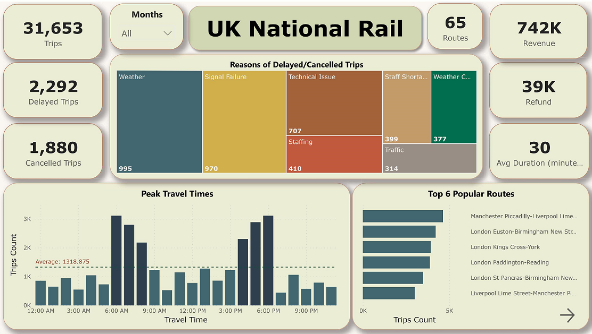
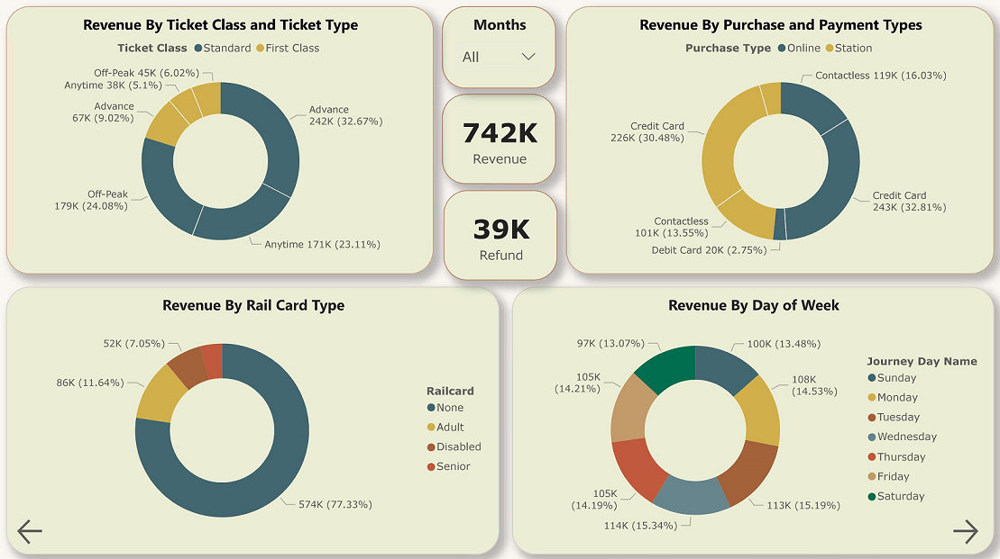
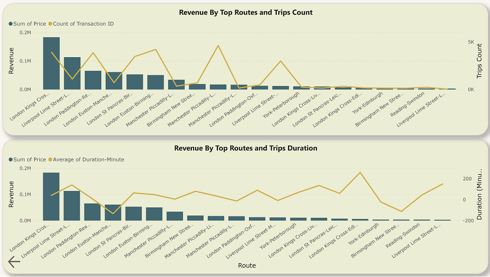

# Analysis of UK National Rail Data

## Introduction
I've done the UK-Rail project to showcase my skills and expertise in data visualization, business intelligence, and analytics using Power BI.

### UK National Rail Data
The data contains mock train ticket sales for National Rail in the UK, from January to April 2024, including details on the type of ticket, the date & time for each journey, the departure & arrival stations, the ticket price, and more.

Dataset can be downloaded from [here](https://maven-datasets.s3.amazonaws.com/UK+Train+Rides/UK+Train+Rides.zip).

### Dataset
Information about the columns of data is provided below : 

- __Transaction ID__: Unique identifier for an individual train ticket purchase
- __Date of Purchase__ : Date the ticket was purchased
- __Time of Purchase__ : Time the ticket was purchased
- __Purchase Type__ : Whether the ticket was purchased online or directly at a train station
- __Payment Method__ : Payment method used to purchase the ticket (Contactles, Credit Card, or Debit Card)
- __Railcard__ : Whether the passenger is a National Railcard holder (Adult, Senior, or Disabled) or not (None). Railcard holders get 1/3 off their ticket purchases.
- __Ticket Class__ : Seat class for the ticket (Standard or First)
- __Ticket Type__ : When you bought or can use the ticket. Advance tickets are 1/2 off and must be purchased at least a day prior to departure. Off-Peak tickets are 1/4 off and must be used outside of peak hours (weekdays between 6-8am and 4-6pm). Anytime tickets are full price and can be bought and used at any time during the day.
- __Price__ : Final cost of the ticket
- __Departure Station__ : Station to board the train
- __Arrival Destination__ : Station to exit the train
- __Date of Journey__ : Date the train departed
- __Departure Time__ : Time the train departed
- __Arrival Time__ : Time the train was scheduled to arrive at its destination (can be on the day after departure)
- __Actual Arrival Time__ : Time the train arrived at its destination (can be on the day after departure)
- __Journey Status__ : Whether the train was on time, delayed, or cancelled
- __Reason for Delay__ : Reason for the delay or cancellation
- __Refund Request__ : Whether the passenger requested a refund after a delay or cancellation

The data also is available at /data folder.

### Objective & Goals
1) Identify the most popular routes
2) Determine peak travel times
3) Analyze revenue from different ticket types & classes
4) Diagnose on-time performance and contributing factors

 

# Analysis Preview

 

